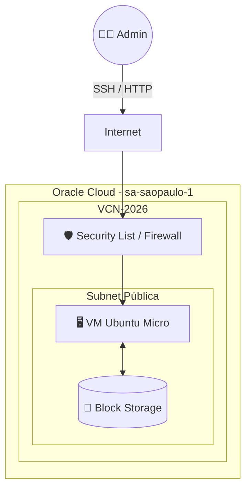

# ☁️ Homelab Cloud – Oracle Infrastructure

> **Resumo:** Homelab em nuvem provisionado na Oracle Cloud Infrastructure (OCI) utilizando o Free Tier, com foco em infraestrutura, automação, redes e serviços self-hosted, operando sem camada de virtualização adicional.

---

## 🧭 Visão Geral da Arquitetura

Este ambiente segue o modelo **Single-node cloud homelab**, operando diretamente sobre IaaS (Infrastructure as a Service).

### Topologia de Rede (Diagrama)

| Componente | Detalhe |
| :--- | :--- |
| **Modelo** | Single-node cloud homelab |
| **Tipo** | IaaS (OCI Compute) |
| **Virtualização** | OCI Hypervisor (Paravirtualized) |
| **Gerenciamento** | SSH + CLI |

## 🌎 Localização e Recursos OCI

| Parâmetro | Valor |
| :--- | :--- |
| **Região** | `sa-saopaulo-1` |
| **Availability Domain** | AD-1 |
| **Fault Domain** | FD-3 |
| **Compartimento** | Root |

## 🖥️ Especificações de Compute

A instância utiliza o shape **Micro**, ideal para estudos e serviços leves dentro do nível gratuito.

| Campo | Configuração |
| :--- | :--- |
| **Shape** | `VM.Standard.E2.1.Micro` |
| **OCPUs** | 1 Core |
| **Memória** | 1 GB RAM |
| **Network BW** | 0.48 Gbps |
| **Boot Mode** | Paravirtualized |
| **Firmware** | UEFI_64 |

## 🐧 Sistema Operacional & Storage

### Storage
* **Boot Volume:** OCI Block Volume.
* **Persistência:** Todos os dados persistem via Block Storage (criptografado em trânsito ✅).
* **Local Disk:** ❌ Não disponível (Stateless).

### OS Build
* **Distribuição:** Canonical Ubuntu 20.04 LTS.
* **Imagem:** `Canonical-Ubuntu-20.04-2025.07.23-0`.

## 🌐 Networking & Segurança

A segurança é baseada em camadas, controlada primariamente pelo Firewall da VCN e secundariamente pelo IPTables do OS.

### Estrutura de Rede

| Campo | Valor |
| :--- | :--- |
| **VCN ID** | `vcn-2026` |
| **Subnet** | Pública (Internet Facing) |
| **IP Público** | Reservado (Static/Ephemeral) |
| **Modelo** | Tráfego direto (Sem Load Balancer/NAT Gateway) |

### 🔐 Acesso e Autenticação
* **Protocolo:** SSH (Porta 22).
* **Autenticação:** 🔑 Key-based only (Senhas desativadas).
* **Bastion Host:** Não utilizado.

### 🛡️ Postura de Segurança (Infra)

| Controle | Status | Observação |
| :--- | :--- | :--- |
| **Encryption in Transit** | ✅ Ativo | Proteção de dados Block Storage. |
| **Secure Boot** | ❌ Inativo | Limitação do Shape/Imagem. |
| **TPM** | ❌ Inativo | Limitação do Shape. |

## ⚙️ Procedimentos Operacionais

### Gestão de Metadados
A instância utiliza **Instance Metadata Service (IMDS) v2** para maior segurança.
* **Uso:** Bootstraping e scripts de inicialização (Cloud-init).
* **Live Migration:** Padrão recomendado ativado.

### Limitações Conhecidas ⚠️
* **Recursos:** Restritos ao Free Tier (1GB RAM exige gerenciamento cuidadoso de swap).
* **Escalabilidade:** Sem escalabilidade vertical automática.
* **Redundância:** Single Point of Failure (SPOF) assumido (sem HA).

## 🧭 Roadmap de Evolução

- [x] Provisionamento Inicial (Compute/Net)
- [x] Acesso SSH Seguro
- [x] Configuração de Firewall (UFW + OCI NSG)
- [ ] Hardening do Ubuntu
- [ ] Instalação Docker Engine & Compose
- [ ] Setup de Reverse Proxy (Nginx/Traefik)
- [ ] Automação de Backup Externo
- [ ] Migração para Infra as Code (Terraform)

---

### 📄 Nota Legal
*Este ambiente é experimental, focado em estudos de infraestrutura, redes e automação. Não destinado a workloads de produção crítica.*
